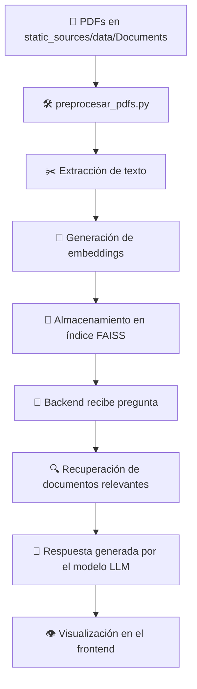

# smartRAGent

**smartRAGent** es un sistema RAG (Retrieval-Augmented Generation) diseñado para ayudar con la documentación interna de [**DESIC**](https://www.desic-sl.com/).  
Utiliza un motor de búsqueda semántica y un modelo de lenguaje para responder preguntas basadas en la documentación interna.

---

## 📝 Tabla de Contenido

- [📂 Estructura del proyecto](#-estructura-del-proyecto)
- [📋 Prerrequisitos](#-prerrequisitos)
- [🚀 Instalación](#-instalación)
- [⚙️ Configuración](#️-configuración)
- [📄 Documentos fuente](#-documentos-fuente)
- [▶️ Ejecución](#️-ejecución)
- [🔄 Diagrama de flujo](#-diagrama-de-flujo)
- [📌 Notas](#-notas)
- [📜 Licencia](#-licencia)

---

## 📂 Estructura del proyecto

```
SMARTRAGENT_LOCAL/
│
├── logs/                                # Archivos de logs generados por la aplicación
├── sql/                                 # Scripts y base de datos SQLite
├── src/
│ ├── backend/                           # Lógica de negocio y procesamiento
│ │ ├── faiss_index_global/              # Índice FAISS general
│ │ ├── faiss_index_normativas/          # Índice FAISS específico para normativas
│ │ ├── chat_db.py                       # Gestión del historial de chats
│ │ ├── embedding_model.pkl              # Modelo de embeddings serializado
│ │ ├── main.py                          # API/servidor backend principal
│ │ ├── model_handler.py                 # Funciones para manejar el modelo LLM
│ │ ├── preprocesar_pdfs.py              # Script para procesar e indexar PDFs
│ │ └── init.py
│ │
│ ├── frontend/                          # Interfaz de usuario con Streamlit
│ │ ├── .streamlit/                      # Configuración de Streamlit
│ │ ├── components/                      # Componentes UI personalizados
│ │ ├── img/                             # Recursos gráficos
│ │ ├── app.py                           # Aplicación principal Streamlit
│ │ └── init.py
│
├── static_sources/                      # Archivos estáticos
│ └── data/
│ └── Documents/                         # PDFs a indexar
├── config.py                            # Configuración en Python
├── config.yaml                          # Configuración en YAML
├── launcher.py                          # Script para lanzar backend y frontend
├── run_app.py                           # Ejecución principal de la app
├── requirements.txt                     # Dependencias del proyecto
└── README.md
```

---

## 📋 Prerrequisitos

Antes de instalar y ejecutar **smartRAGent**, asegúrate de contar con:

- [**Python** 3.9 o superior](https://www.python.org/downloads/)
- **pip** actualizado (`pip install --upgrade pip`)  
- [**Git**](https://git-scm.com/downloads) para clonar el repositorio
- Sistema operativo compatible: **Windows**, **Linux** o **macOS**  
- Acceso a internet para instalar dependencias  

---

## 🚀 Instalación

1. **Clonar el repositorio**
```bash
   git clone tengo_que _cambiar_la_ruta.git
   cd smartRAGent
```

2. **Instalar dependencias**
```bash
   pip install --upgrade pip
   pip install -r requirements.txt
```

---

## ⚙️ Configuración

El proyecto utiliza un archivo `config.yaml` para parámetros como rutas de datos, modelos, imágenes y opciones de conexión.  
Asegúrate de configurarlo antes de ejecutar la aplicación.

Ejemplo:
```yaml
database_path:    "sql/chat_history.db"
faiss_index_path: "src/backend/faiss_index_global"
embedding_model:  "src/backend/embedding_model.pkl"
documents_path:   "static_sources/data/Documents"
```

---

## 📄 Documentos fuente

Los PDFs que se desean indexar deben colocarse en:

```bash
   static_sources/data/Documents
```
El script preprocesar_pdfs.py tomará los archivos de esa carpeta, extraerá su contenido y lo transformará en embeddings que serán almacenados en el índice FAISS para su posterior uso.

---

## ▶️ Ejecución

1. **Preprocesar documentos PDF**  
Este paso construye el índice FAISS a partir de la documentación interna.

```bash
   python src/backend/preprocesar_pdfs.py
```

2. **Iniciar el backend**
```bash
   python src/backend/main.py
```

3. **Iniciar el frontend (Streamlit)**
```bash
   streamlit run src/frontend/app.py
```

4. **O ejecutar todo con el lanzador**
```bash
   python launcher.py
```

---

## 🔄 Diagrama de flujo


---

## 📌 Notas

- **smartRAGent** utiliza FAISS para búsquedas semánticas y un modelo de embeddings (`embedding_model.pkl`).
- Los PDFs a indexar deben colocarse en static_sources/data/Documents antes de ejecutar preprocesar_pdfs.py.
- El sistema está optimizado para entornos internos de [DESIC](https://www.desic-sl.com/).

---

## 📜 Licencia

Este proyecto es de uso interno de [**DESIC**](https://www.desic-sl.com/) y no debe compartirse fuera de la organización.
Todos los derechos pertenecel a [DESIC.S.L](https://www.desic-sl.com/)
